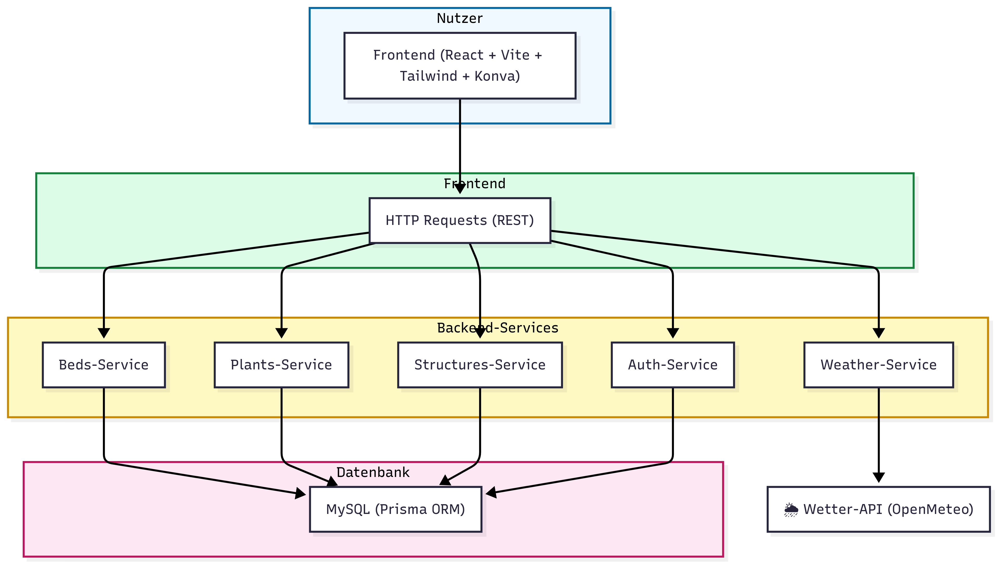

This is a web application that lets you plan your garden. You can add and edit structures such as houses, paths and terraces, flowerbeds and singular plants. The connection to openMeteo lets you control the rainfall on your garden and lets you know when to water them

#### still under construction, deployment planned on https://render.com/

